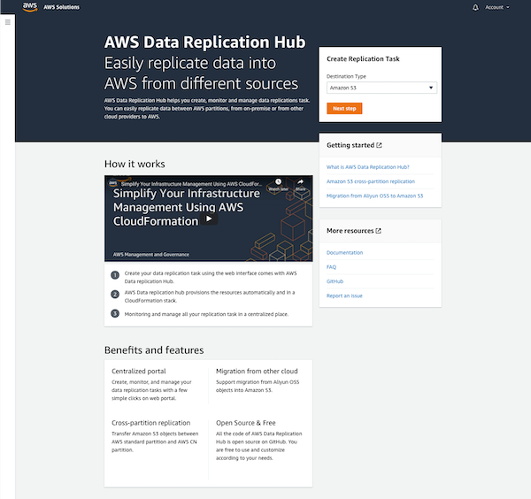
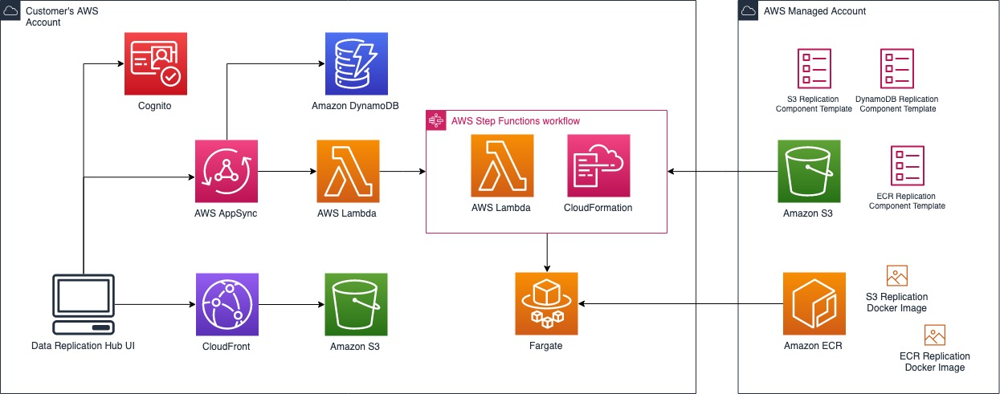

# AWS Data Replication Hub

A reliable, secure, scalable AWS solution that enabled structured and unstructured data replication from different sources to AWS.

_Note_: If you have already deployed this solution. Please refer to [User Guide](docs/UserManual.md) for the web portal usage.



## Features

- [x] Authentication
- [x] Self-service User Interface
- [x] CDK Deployment
- [x] CloudFormation Deployment
- [x] S3 Plugin
    - [x] Amazon S3 object replication between AWS Standard partition and AWS CN partition
    - [x] Replication from Alibaba Cloud OSS to Amazon S3
    - [x] Replication from Tencent COS to Amazon S3
    - [x] Replication from Qiniu Kodo to Amazon S3
    - [ ] Replication from Huawei Cloud OBS
    - [x] Support replication with Metadata
    - [x] Support One-time replication
    - [x] Support Incremental replication
- [ ] ECR Plugin
    - [ ] Image replication between AWS Standard partition and AWS CN partition
    - [ ] Image replication from Docker Hub to ECR
    - [ ] Image replication from gcr.io to ECR
- [ ] DynamoDB Plugin

## Architecture



A web portal will be launched in the customer's AWS account. Through the web portal, customers can create replication tasks and manage them in a centralized place. 

Each type of replication is a plugin for this solution. You can also use the plugin independently without user interface. 

## Deploy via CloudFormation

You can choose to [deploy via AWS CDK](#deploy-via-aws-cdk) or deploy via direct launch CloudFormation template.

**Time to deploy:** Approximately 15 minutes.

Follow the step-by-step instructions in this section to configure and deploy the AWS Data Replication Hub into your account.

1. Make sure you have sign in AWS Console already.
1. Click the following button to launch the CloudFormation Stack in your account.

    [](https://console.aws.amazon.com/cloudformation/home#/stacks/create/template?stackName=DataReplicationHubStack&templateURL=https://aws-gcr-solutions.s3.amazonaws.com/Aws-data-replication-hub/v1.0.1/AwsDataReplicationHub.template)
1. Input **AdminEmail** parameter
1. Click **Next** and select **Create Stack**.

## Deploy via AWS CDK

_Note_: You should choose either [Deploy via CloudFormation](#deploy-via-cloudformation) or [Deploy via AWS CDK](#deploy-via-aws-cdk). If you are don't want to install the dependencies on your local machine. Please choose [Deploy via CloudFormation](#deploy-via-cloudformation).

### Prerequisites

Please install the following dependencies on your local machine.

* nodejs 12+
* npm 6+
* AWS CDK CLI v1.64.1
* Docker

You need CDK bootstrap v4+ to deploy this application. To upgrade to latest CDK bootstrap version. Run 
```
cdk bootstrap --cloudformation-execution-policies arn:aws:iam::aws:policy/AdministratorAccess
```

Please make sure Docker is running on your local machine.

### Build the Web Portal assets

The Web Portal is being built with React and [AWS Amplify](https://docs.amplify.aws/) framework.
```
cd source/portal
npm install
npm run build
```
The output assets will be located in `source/portal/build` directory.

### CDK Synth & CDK Deploy
_Note_: Please make sure Docker is running. 

```
cd ../constructs
npm install 
npm run build
cdk synth
cdk deploy --parameters AdminEmail=<your-email-address>
```

The only parameter you should specify is the default user's email address. It will serve as the username when login into the web portal.

## Login into the Data Replication Hub Portal

An email containing the temporary password will be sent to the provided email address. Copy and paste it somewhere.

If you deploy via CloudFormation, check the output of the stack. The  `PortalUrl` is the link of the portal. If you are using AWS CDK, you can find a output in terminal named `AwsDataReplicationHub.PortalUrl`. 

1. Open the portal in browser, it will be navigated to a login page. 
1. Sign in with the **AdminEmail**, and the temporary password.
1. You will be asked to set a new password.
1. You will also be asked to verify your email address in order to turn on account recovery. You can skip if you need.
1. The page will be redirected to the login page. 
1. Input the **AdminEmail** and the new password.

Now, you are all set. Start to create your first replication task. For the completed user guide, please visit
[User Guide](docs/UserManual.md) for more information.

## File Structure

```
|- .github/ ...               - resources for open-source contributions.
|- docs/ ...                  - documentation.
|- deployment/                - contains build scripts, deployment templates, and dist folders for staging assets.
  |- cdk-solution-helper/     - helper function for converting CDK output to a format compatible with the AWS Solutions pipelines.
  |- build-open-source-dist.sh  - builds the open source package with cleaned assets and builds a .zip file in the /open-source folder for distribution to GitHub
  |- build-s3-dist.sh         - builds the solution and copies artifacts to the appropriate /global-s3-assets or /regional-s3-assets folders.
|- source/                    - all source code, scripts, tests, etc.
  |- contructs/               - the CDK app
  |- custom-resource/         - CloudFormation custom resource
  |- portal/                  - The web portal of AWS data replication hub
  |- schema/                  - The GraphQL API schema
|- .gitignore
|- CHANGELOG.md               - required for every solution to include changes based on version to auto-build release notes.
|- CODE_OF_CONDUCT.md         - standardized open source file for all solutions.
|- CONTRIBUTING.md            - standardized open source file for all solutions.
|- LICENSE.txt                - required open source file for all solutions - should contain the Apache 2.0 license.
|- NOTICE.txt                 - required open source file for all solutions - should contain references to all 3rd party libraries.
|- README.md                  - required file for all solutions.
```

## Building Your Own Distributable
If you are a user of this solution. You should simply use the hosted [CloudFormation Stack link](#deploy-via-cloudformation) 
to deploy it. If you would like to contribute to this solution, or want to build your own CloudFormation distributable, please
use th following steps to verify your code. 

* Configure the bucket name of your target Amazon S3 distribution bucket
```
export BUCKET_NAME=my-bucket-name # bucket where customized code will reside
export SOLUTION_NAME=my-solution-name
export VERSION=my-version # version number for the customized code
export REGION=aws-region # the aws region where you are testing the customized solution
```
_Note:_ You would have to create an S3 bucket with the prefix 'my-bucket-name-<aws_region>'; aws_region is where you 
are testing the customized solution. Also, the assets in bucket should be publicly accessible.

_Note:_ you must have the AWS Command Line Interface installed.

* Now build the distributable:
```
cd deployment/
chmod +x ./build-s3-dist.sh
./build-s3-dist.sh $BUCKET_NAME $SOLUTION_NAME $VERSION
```

* Deploy the distributable assets to an Amazon S3 bucket in your account.
```
aws s3 sync ./regional-s3-assets/ s3://$BUCKET_NAME-$REGION/$SOLUTION_NAME/$VERSION/ --delete --acl bucket-owner-full-control
```

* Copy the CloudFormation template to Amazon S3 bucket in your account.
```
aws s3 cp ./global-s3-assets/AwsDataReplicationHub.template s3://$BUCKET_NAME-$REGION/$SOLUTION_NAME/$VERSION/ --acl bucket-owner-full-control
```

* Get the link of the solution template uploaded to your Amazon S3 bucket.
* Deploy the solution to your account by launching a new AWS CloudFormation stack using the link of the solution template in Amazon S3.

